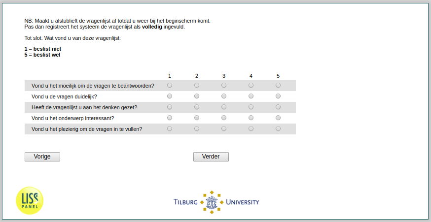

.. _tuce-eva2t: 

 
 .. role:: raw-html(raw) 
        :format: html 
 
`eva2t` – Questionnaire Evaluation
================================== 

:raw-html:`&larr;` :ref:`tuce-v6bt` 
 

Note: Please complete the questionnaire until you get back to the home screen.
Only then will the system register the questionnaire as completed.

Finally. What did you think of this questionnaire:
1 = definitely not
5 = definiltely yes
 
.. csv-table:: 
   :delim: | 
   :header: ,1,2,3,4,5
 
           Did you find it difficult to answer the questions? | :raw-html:`&#10063;`|:raw-html:`&#10063;`|:raw-html:`&#10063;`|:raw-html:`&#10063;`|:raw-html:`&#10063;` 
           Did you find the questions clear? | :raw-html:`&#10063;`|:raw-html:`&#10063;`|:raw-html:`&#10063;`|:raw-html:`&#10063;`|:raw-html:`&#10063;` 
           Did the questionnaire get you thinking? | :raw-html:`&#10063;`|:raw-html:`&#10063;`|:raw-html:`&#10063;`|:raw-html:`&#10063;`|:raw-html:`&#10063;` 
           Did you find the subject interesting? | :raw-html:`&#10063;`|:raw-html:`&#10063;`|:raw-html:`&#10063;`|:raw-html:`&#10063;`|:raw-html:`&#10063;` 
           Did you enjoy filling in the questions? | :raw-html:`&#10063;`|:raw-html:`&#10063;`|:raw-html:`&#10063;`|:raw-html:`&#10063;`|:raw-html:`&#10063;` 

:raw-html:`&larr;` :ref:`tuce-v6bt` 
 
