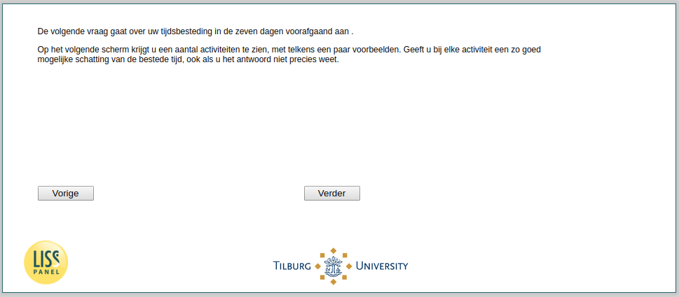

.. _tuce-intro2: 

 
 .. role:: raw-html(raw) 
        :format: html 
 
`intro2` – Intro 2: Time spent in the past week/week before Kings Day
===================================================================== 

:raw-html:`&larr;` :ref:`tuce-vacation1-sick` | :ref:`tuce-v1q1` :raw-html:`&rarr;` 
 

The next question is about your time spent in the seven days prior to today/Kings Day.
On the next screen you will see a number of activities, each with a few examples. For each activity, give you the best possible estimate of the time spent, even if you do not know the exact answer. 
 

:raw-html:`&larr;` :ref:`tuce-vacation1-sick` | :ref:`tuce-v1q1` :raw-html:`&rarr;` 
 
