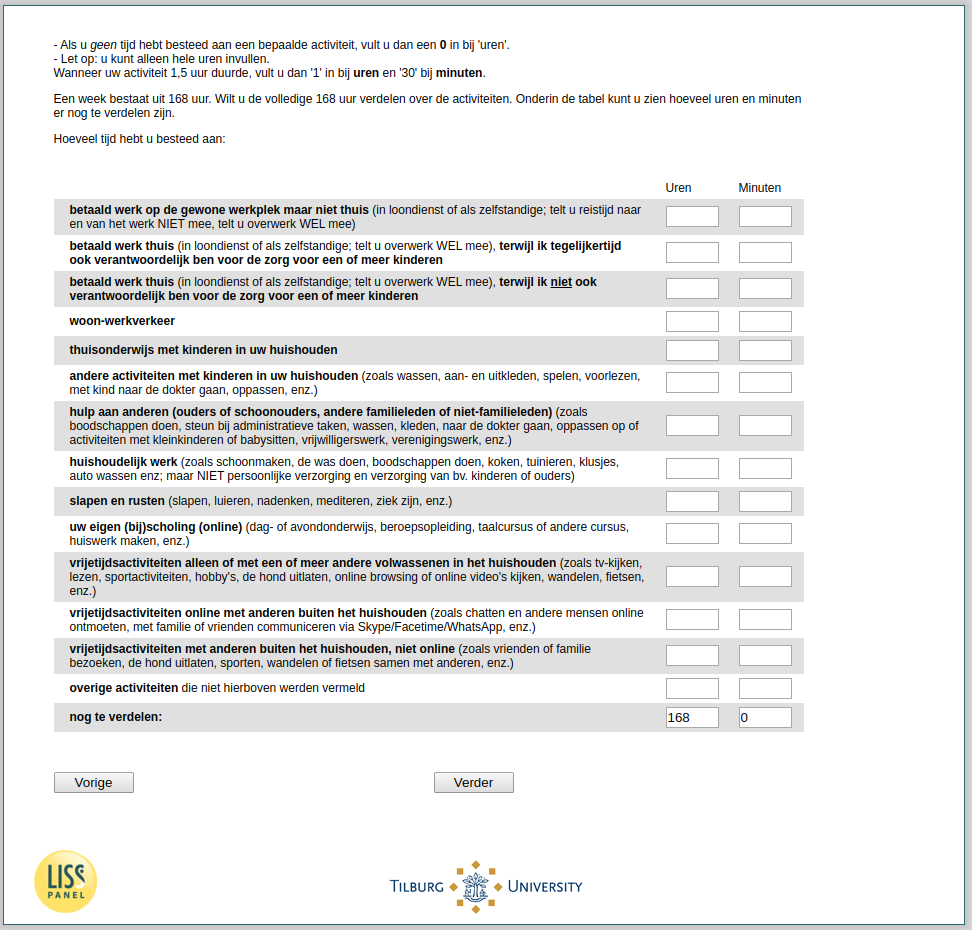

.. _tuce-v1q1: 

 
 .. role:: raw-html(raw) 
        :format: html 
 
`v1q1` – Time Spent Past 7 Days
=============================== 

:raw-html:`←` :ref:`tuce-intro2` | :ref:`tuce-vpartner` :raw-html:`→` 
 

- If you haven't spent any time on a certain activity, enter a 0 under 'hours'. 
- Note: you can only fill in whole hours. 
If your activity lasted 1.5 hours, enter '1' under hours and '30' under minutes. 
A week consists of 168 hours. Would you like to divide the full 168 hours between the activities. At the bottom of the table you can see how many hours and minutes there are still to be divided.
How much time have you spent on:
 
.. csv-table:: 
   :delim: | 
   :header: ,Hours, Minutes
 
           paid work at the usual place of work but not at home  | :raw-html:`<form><input type="text" id="fname" name="fname"> </form>` |:raw-html:`<form><input type="text" id="fname" name="fname"> </form>` 
           paid work at home/home office  | :raw-html:`<form><input type="text" id="fname" name="fname"> </form>` |:raw-html:`<form><input type="text" id="fname" name="fname"> </form>` 
           paid work at home while at the same time I am also responsible for the care of one or more children | :raw-html:`<form><input type="text" id="fname" name="fname"> </form>` |:raw-html:`<form><input type="text" id="fname" name="fname"> </form>` 
           paid work at home while I am not also responsible for the care of one or more children | :raw-html:`<form><input type="text" id="fname" name="fname"> </form>` |:raw-html:`<form><input type="text" id="fname" name="fname"> </form>` 
           commuting | :raw-html:`<form><input type="text" id="fname" name="fname"> </form>` |:raw-html:`<form><input type="text" id="fname" name="fname"> </form>` 
           home schooling with children in your household | :raw-html:`<form><input type="text" id="fname" name="fname"> </form>` |:raw-html:`<form><input type="text" id="fname" name="fname"> </form>` 
           other activities with children in your household (such as washing/ dressing and undressing/ playing/ reading aloud/ going to the doctor with the child/ babysitting/ etc.) | :raw-html:`<form><input type="text" id="fname" name="fname"> </form>` |:raw-html:`<form><input type="text" id="fname" name="fname"> </form>` 
           assistance to others (parents or in-laws/ other family members or non-family members) | :raw-html:`<form><input type="text" id="fname" name="fname"> </form>` |:raw-html:`<form><input type="text" id="fname" name="fname"> </form>` 
           housework | :raw-html:`<form><input type="text" id="fname" name="fname"> </form>` |:raw-html:`<form><input type="text" id="fname" name="fname"> </form>` 
           sleep and rest  | :raw-html:`<form><input type="text" id="fname" name="fname"> </form>` |:raw-html:`<form><input type="text" id="fname" name="fname"> </form>` 
           your own (additional) training (online) (day- or evening classes, vocational training, language course or other course, doing homework, etc.). | :raw-html:`<form><input type="text" id="fname" name="fname"> </form>` |:raw-html:`<form><input type="text" id="fname" name="fname"> </form>` 
           leisure activities alone | :raw-html:`<form><input type="text" id="fname" name="fname"> </form>` |:raw-html:`<form><input type="text" id="fname" name="fname"> </form>` 
           leisure activities online with others  | :raw-html:`<form><input type="text" id="fname" name="fname"> </form>` |:raw-html:`<form><input type="text" id="fname" name="fname"> </form>` 
           leisure activities alone | :raw-html:`<form><input type="text" id="fname" name="fname"> </form>` |:raw-html:`<form><input type="text" id="fname" name="fname"> </form>` 
           other activities not mentioned above | :raw-html:`<form><input type="text" id="fname" name="fname"> </form>` |:raw-html:`<form><input type="text" id="fname" name="fname"> </form>` 
           yet to be distributed: (was filled in automatically) | :raw-html:`<form><input type="text" id="fname" name="fname"> </form>` |:raw-html:`<form><input type="text" id="fname" name="fname"> </form>` 

:raw-html:`&larr;` :ref:`tuce-intro2` | :ref:`tuce-vpartner` :raw-html:`&rarr;` 
 
