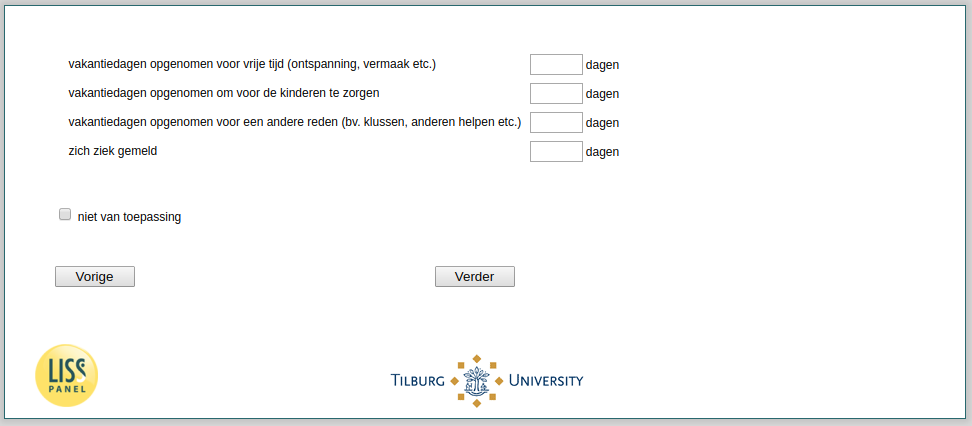

.. _tuce-vacation1-sick: 

 
 .. role:: raw-html(raw) 
        :format: html 
 
`vacation1-sick` – Vacation & Sick Days past Week
================================================= 

:raw-html:`←` :ref:`tuce-q2b_pre_post` | :ref:`tuce-intro2` :raw-html:`→` 
 

ast week, how many days do you have..
 
.. csv-table:: 
   :delim: | 
   :header: ,Days
 
           holidays taken for leisure (relaxation/ entertainment/ etc.) | :raw-html:`<form><input type="text" id="fname" name="fname"> </form>` 
           holidays taken for another reason (e.g. chores/ helping others etc.) | :raw-html:`<form><input type="text" id="fname" name="fname"> </form>` 
           holidays taken for another reason (e.g. chores/ helping others etc.) | :raw-html:`<form><input type="text" id="fname" name="fname"> </form>` 
           reported sick | :raw-html:`<form><input type="text" id="fname" name="fname"> </form>` 

:raw-html:`&larr;` :ref:`tuce-q2b_pre_post` | :ref:`tuce-intro2` :raw-html:`&rarr;` 
 
