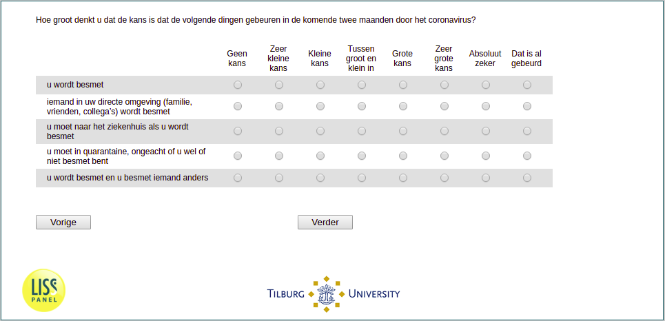

.. _q1:

 
 .. role:: raw-html(raw) 
        :format: html 

q1 Subjective Risks
===================

How likely do you think that the following events will happen in the light of the current coronavirus Outbreak?

.. csv-table::
   :delim: |
   :header: ,not at all likely, very unlikely, rather unlikely, moderately likely, rather likely, very likely, certain, has already happened

           You will be infected|:raw-html:`&#10063;`|:raw-html:`&#10063;`|:raw-html:`&#10063;`|:raw-html:`&#10063;`|:raw-html:`&#10063;`|:raw-html:`&#10063;`|:raw-html:`&#10063;`|:raw-html:`&#10063;`
           Someone in your direct environment (family, friends, colleagues) will be infected|:raw-html:`&#10063;`|:raw-html:`&#10063;`|:raw-html:`&#10063;`|:raw-html:`&#10063;`|:raw-html:`&#10063;`|:raw-html:`&#10063;`|:raw-html:`&#10063;`|:raw-html:`&#10063;`
           You will have to go to the hospital if you get the infection |:raw-html:`&#10063;`|:raw-html:`&#10063;`|:raw-html:`&#10063;`|:raw-html:`&#10063;`|:raw-html:`&#10063;`|:raw-html:`&#10063;`|:raw-html:`&#10063;`|:raw-html:`&#10063;`
           You get infected and you infect someone else|:raw-html:`&#10063;`|:raw-html:`&#10063;`|:raw-html:`&#10063;`|:raw-html:`&#10063;`|:raw-html:`&#10063;`|:raw-html:`&#10063;`|:raw-html:`&#10063;`|:raw-html:`&#10063;`

:ref:`q2` :raw-html:`&rarr;`
