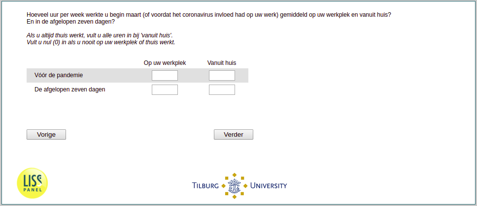

.. _q14:

 
 .. role:: raw-html(raw) 
        :format: html 

q14 Working Hours
=================

On average, how many hours per week did you work at the workplace and from home in early March (or before the coronavirus affected your work)? And in the past seven days? If you always work from home, fill in all hours at 'from home'. Enter zero (0) if you never work at your workplace or at home.

.. csv-table::
   :delim: |
   :header: ,Number of hours

           Hours at workplace in the past seven days| 
           Hours at from home in the past seven days| 
           Hours at from home before the pandemic| 
           Hours at workplace before the pandemic| 

:raw-html:`&larr;` :ref:`q12` | :ref:`q15` :raw-html:`&rarr;`
