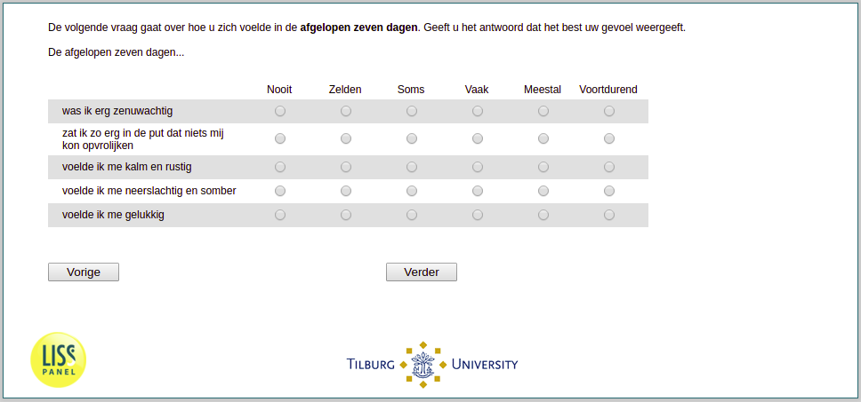

.. _q30:

 
 .. role:: raw-html(raw) 
        :format: html 

q30 Mental Health in the Past Week
==================================

The next question is about how you have felt in the past seven days. Please give the answer that best reflects your feelings. The past seven days …

.. csv-table::
   :delim: |
   :header: ,never, rarely, sometimes, often, mostly, constantly

           I felt depressed and gloomy ``gloomy`` | :raw-html:`❏`|:raw-html:`❏`|:raw-html:`❏`|:raw-html:`❏`|:raw-html:`❏`|:raw-html:`❏`
           I felt calm and peaceful ``calm`` | :raw-html:`❏`|:raw-html:`❏`|:raw-html:`❏`|:raw-html:`❏`|:raw-html:`❏`|:raw-html:`❏`
           I felt happy ``happy`` | :raw-html:`❏`|:raw-html:`❏`|:raw-html:`❏`|:raw-html:`❏`|:raw-html:`❏`|:raw-html:`❏`
           I felt very anxious ``nervous`` | :raw-html:`❏`|:raw-html:`❏`|:raw-html:`❏`|:raw-html:`❏`|:raw-html:`❏`|:raw-html:`❏`
           I felt so down that nothing could cheer me up ``depressed`` | :raw-html:`❏`|:raw-html:`❏`|:raw-html:`❏`|:raw-html:`❏`|:raw-html:`❏`|:raw-html:`❏`

:raw-html:`←` :ref:`q29` | :ref:`q31` :raw-html:`→`
