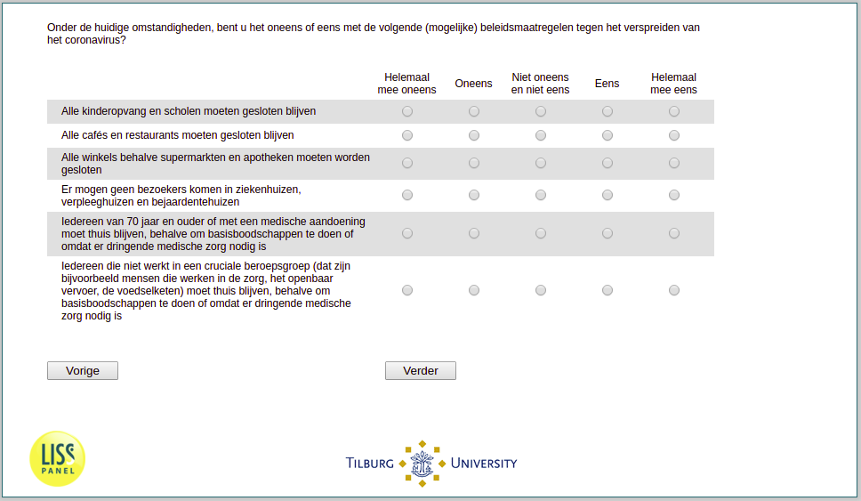

.. _q8:

 
 .. role:: raw-html(raw) 
        :format: html 

q8 Support for Policies
=======================

Given the spread of the pandemic today, do you disagree or agree with the following policy measures (whether they are implemented or not at present)?

.. csv-table::
   :delim: | 
   :header: ,totally disagree, disagree, neither/nore, agree, totally agree

           No visitors in hospitals and elderly homes. ``supp_no_visitors`` | :raw-html:`&#10063;`|:raw-html:`&#10063;`|:raw-html:`&#10063;`|:raw-html:`&#10063;`|:raw-html:`&#10063;`
           All shops except for supermarkets and pharmacies have to stay closed. ``supp_close_most_shops`` | :raw-html:`&#10063;`|:raw-html:`&#10063;`|:raw-html:`&#10063;`|:raw-html:`&#10063;`|:raw-html:`&#10063;`
           All Cafes and restaurants have to stay closed. ``supp_close_cafes`` | :raw-html:`&#10063;`|:raw-html:`&#10063;`|:raw-html:`&#10063;`|:raw-html:`&#10063;`|:raw-html:`&#10063;`
           All Kindergardens and schools have to stay closed. ``supp_close_schools`` | :raw-html:`&#10063;`|:raw-html:`&#10063;`|:raw-html:`&#10063;`|:raw-html:`&#10063;`|:raw-html:`&#10063;`
           Everyone who does not work in a crucial professional group (for example, people who work in healthcare, public transport, the food chain) has to stay at home except to do basic shopping or because urgent medical care is required. ``supp_curfew_non_crucial`` | :raw-html:`&#10063;`|:raw-html:`&#10063;`|:raw-html:`&#10063;`|:raw-html:`&#10063;`|:raw-html:`&#10063;`
           People aged 70 and over or with a medical condition have to stay at home except to do basic shopping or because urgent medical attention is required. ``supp_curfew_high_risk`` | :raw-html:`&#10063;`|:raw-html:`&#10063;`|:raw-html:`&#10063;`|:raw-html:`&#10063;`|:raw-html:`&#10063;`

:raw-html:`&larr;` :ref:`q7` | :ref:`q9` :raw-html:`&rarr;`
