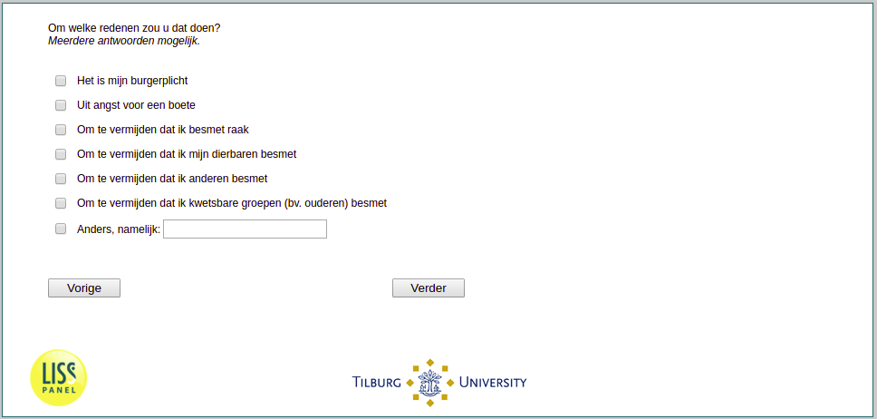

.. _w1e-q11: 

 
 .. role:: raw-html(raw) 
        :format: html 
 
`q11` – Reasons for Complying with Curfew
=============================================== 

:raw-html:`&larr;` :ref:`w1e-q10` | :ref:`w1e-q12` :raw-html:`&rarr;` 
 
*Routing to the question depends on answer in:* :ref:`w1e-q10` 

For what reasons would you stay home? Multiple answers possible.
 
:raw-html:`&#10063;` – It is my civic duty
 
:raw-html:`&#10063;` – For fear of a fine
 
:raw-html:`&#10063;` – To avoid getting infected
 
:raw-html:`&#10063;` – To avoid infecting my loved ones
 
:raw-html:`&#10063;` – To avoid infecting others
 
:raw-html:`&#10063;` – To avoid infecting vulnerable groups (e.g., the elderly)
 
:raw-html:`&#10063;` – I would comply with a curfew for another reason.
 

:raw-html:`&larr;` :ref:`w1e-q10` | :ref:`w1e-q12` :raw-html:`&rarr;` 
 
