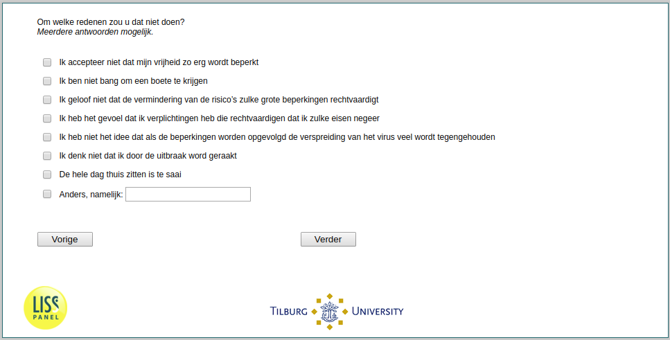

.. _w1e-q12:

 
 .. role:: raw-html(raw) 
        :format: html 

`q12` – Reasons for Disobeying a Curfew
=======================================

:raw-html:`&larr;` :ref:`w1e-q11` | :ref:`w1e-q13` :raw-html:`&rarr;` 

*Routing to the question depends on answer in:* :ref:`w1e-q10`

For what reasons would you not stay at home? Multiple answers possible.

:raw-html:`&#10063;` – I am unwilling to accept such drastic restrictions of my freedoms.

:raw-html:`&#10063;` – I am not afraid of being fined

:raw-html:`&#10063;` – I do not think the reduction in risk warrants such drastic restrictions.

:raw-html:`&#10063;` – I feel I have obligations that justify disobeying such orders.

:raw-html:`&#10063;` – I do not think following the restrictions would slow the transmission tangibly

:raw-html:`&#10063;` – I do not think I will be affected by the outbreak.

:raw-html:`&#10063;` – Staying home all the time would be too boring.

:raw-html:`&#10063;` – I would not comply with a curfew for another reason.

:raw-html:`&larr;` :ref:`w1e-q11` | :ref:`w1e-q13` :raw-html:`&rarr;` 

