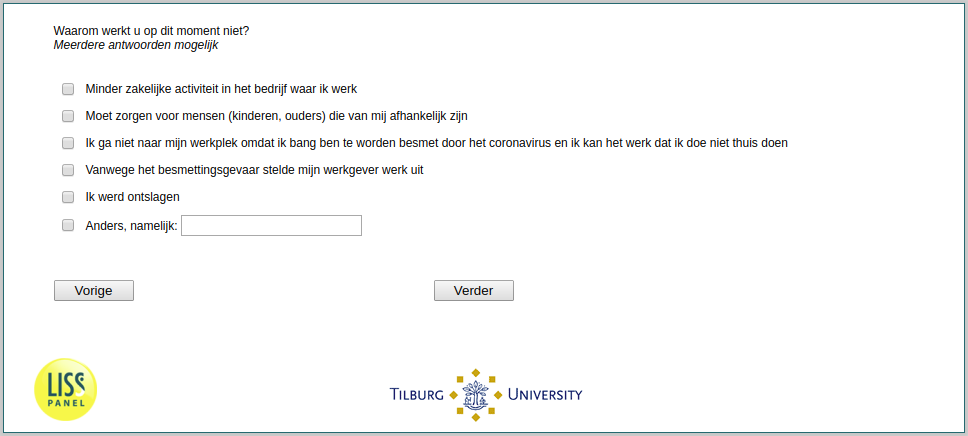

.. _w1e-q15:

 
 .. role:: raw-html(raw) 
        :format: html 

`q15` – Reasons for Not Working Among Employees
===============================================

:raw-html:`&larr;` :ref:`w1e-q14` | :ref:`w1e-q16` :raw-html:`&rarr;` 

*Routing to the question depends on answer in:* :ref:`w1e-q14`

Why are you not working right now? Multiple answers possible

:raw-html:`&#10063;` – Less business activity of the company I work for

:raw-html:`&#10063;` – I need to take care of people (children, parents) who depend on me

:raw-html:`&#10063;` – I do not go to my workplace because I am afraid of being infected by the coronavirus and I cannot do the work I do at home

:raw-html:`&#10063;` – Because of the risk of infection, my employer postponed work

:raw-html:`&#10063;` – I got fired

:raw-html:`&#10063;` – Another reason.

:raw-html:`&larr;` :ref:`w1e-q14` | :ref:`w1e-q16` :raw-html:`&rarr;` 

