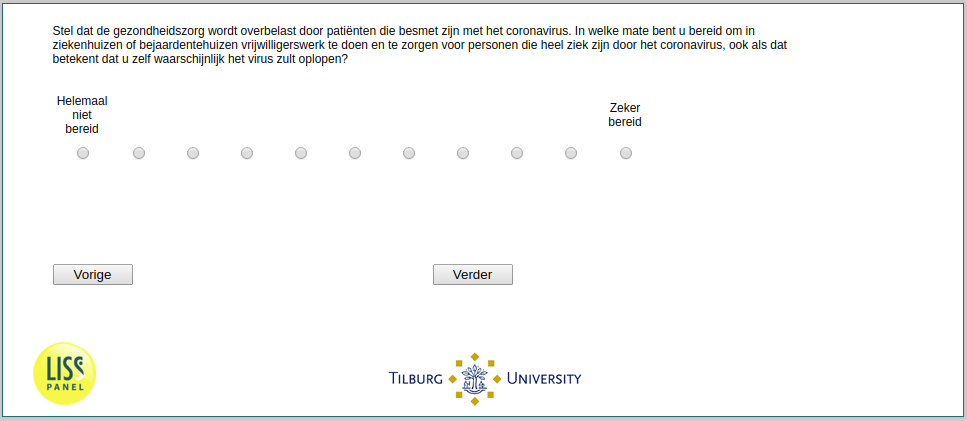

.. _w1e-q20:

 
 .. role:: raw-html(raw) 
        :format: html 

`q20` – Availability to Help
============================

:raw-html:`←` :ref:`w1e-q19` | :ref:`w1e-q21` :raw-html:`→` 

*Routing to the question depends on answer in:* :ref:`w1e-q19`

Suppose healthcare is overloaded by patients infected with the coronavirus. To what extent are you willing to volunteer in hospitals or retirement homes and care for people who are very ill from the coronavirus, even if that means that you are likely to contract the virus yourself?

.. csv-table::
   :delim: |
   :header: 0 not prepared at all, 1, 2, 3, 4, 5, 6, 7, 8, 9, 10 definitely prepared

           :raw-html:`❏`|:raw-html:`❏`|:raw-html:`❏`|:raw-html:`❏`|:raw-html:`❏`|:raw-html:`❏`|:raw-html:`❏`|:raw-html:`❏`|:raw-html:`❏`|:raw-html:`❏`|:raw-html:`❏`

:raw-html:`←` :ref:`w1e-q19` | :ref:`w1e-q21` :raw-html:`→` 

