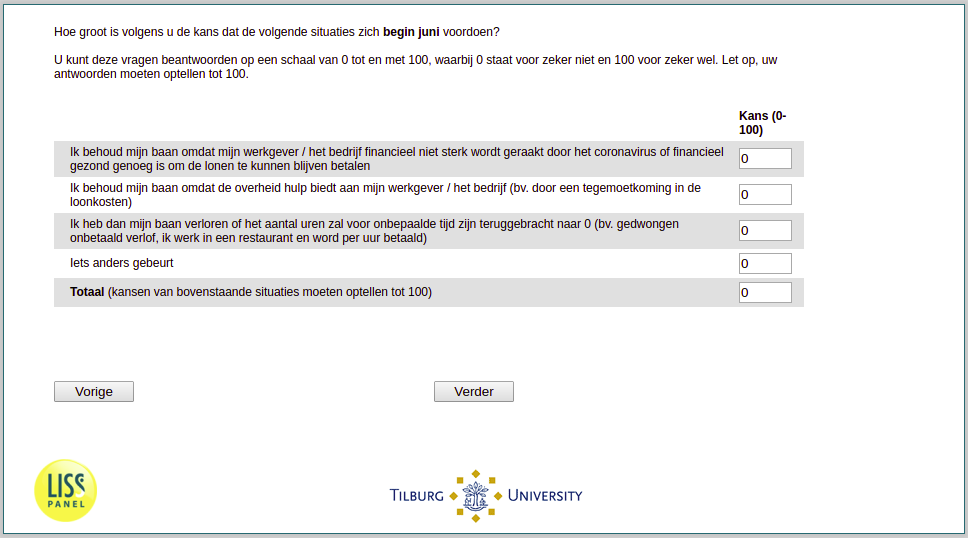

.. _w1e-q26: 

 
 .. role:: raw-html(raw) 
        :format: html 
 
`q26` – Employment Among Employees
======================================== 

:raw-html:`&larr;` :ref:`w1e-q25` | :ref:`w1e-q27header` :raw-html:`&rarr;` 
 

How likely do you think the following situations will happen in early June? You can answer these questions on a scale from 0 to 100, where 0 stands for certainly not and 100 stands for certainly. Please note, your answers must add up to 100.
 
.. csv-table:: 
   :delim: | 
   :header: ,Probability [0-100]
 
            I will keep my job because my employer / company is not financially affected by the corona virus or is financially healthy enough to continue to pay wages | :raw-html:`<form><input type="text" id="fname" name="fname"> </form>` 
           I will keep my job because the government provides help to my employer / company (eg by paying wages) | :raw-html:`<form><input type="text" id="fname" name="fname"> </form>` 
            I will have lost my job or the number of hours will have been reduced to 0 indefinitely (e.g., forced unpaid leave, I am paid per hour in a restaurant …) | :raw-html:`<form><input type="text" id="fname" name="fname"> </form>` 
           Something else is happening | :raw-html:`<form><input type="text" id="fname" name="fname"> </form>` 

:raw-html:`&larr;` :ref:`w1e-q25` | :ref:`w1e-q27header` :raw-html:`&rarr;` 
 
