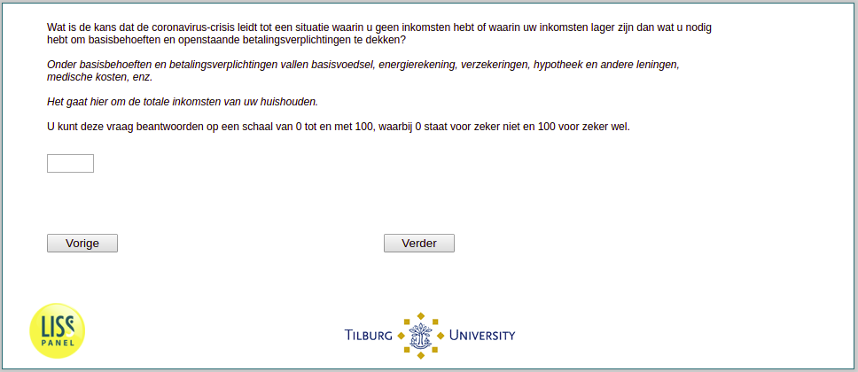

.. _w1e-q28: 

 
 .. role:: raw-html(raw) 
        :format: html 
 
`q28` – Probability of Period With Low Income
=================================================== 

:raw-html:`←` :ref:`w1e-q27header` | :ref:`w1e-q29` :raw-html:`→` 
 

What is the probability that the Coronavirus crisis will lead to a situation where you have no income or where your income is lower than what you need to cover basic needs and outstanding payment obligations? Basic needs and payment obligations include basic food, utility bills, insurance, mortgage and other loans, medical expenses, etc. This concerns the total income of your household. You can answer this question on a scale from 0 to 100, where 0 stands for certainly not and 100 stands for certainly. 
 

:raw-html:`←` :ref:`w1e-q27header` | :ref:`w1e-q29` :raw-html:`→` 
 
