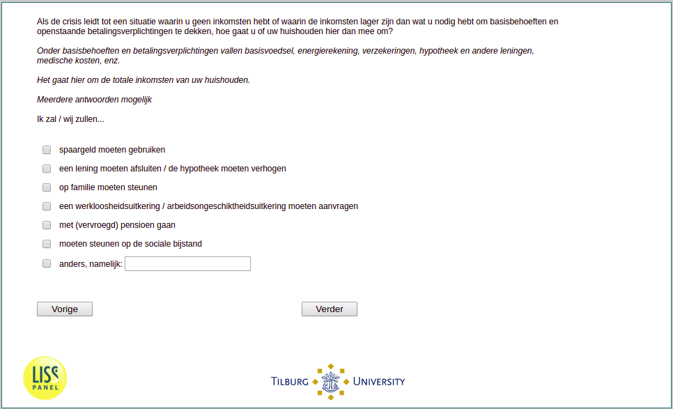

.. _w1e-q29: 

 
 .. role:: raw-html(raw) 
        :format: html 
 
`q29` – Economic Coping Strategies
======================================== 

:raw-html:`&larr;` :ref:`w1e-q28` | :ref:`w1e-q30` :raw-html:`&rarr;` 
 

If the crisis leads to a situation where you have no income or where the income is lower than what you need to cover basic needs and outstanding payment obligations, how do you or your household deal with this? Basic needs and payment obligations include basic food, utility bills, insurance, mortgage and other loans, medical expenses, etc. This concerns the total income of your household. Multiple answers possible. I will / we will …
 
:raw-html:`&#10063;` – tap into my/our savings
 
:raw-html:`&#10063;` – take out a loan / increase the mortgage
 
:raw-html:`&#10063;` – would rely on family
 
:raw-html:`&#10063;` – would apply for unemployment / disability benefits
 
:raw-html:`&#10063;` – apply for my (early) retirement pension
 
:raw-html:`&#10063;` – must rely on social assistance
 
:raw-html:`&#10063;` – something else. 
 

:raw-html:`&larr;` :ref:`w1e-q28` | :ref:`w1e-q30` :raw-html:`&rarr;` 
 
