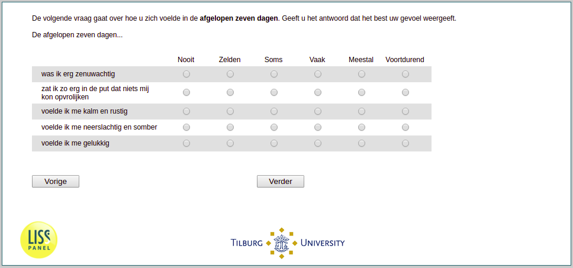

.. _w1e-q30:

 
 .. role:: raw-html(raw) 
        :format: html 

`q30` – Mental Health in the Past Week
==================================

The next question is about how you have felt in the past seven days. Please give the answer that best reflects your feelings. The past seven days …

.. csv-table::
   :delim: |
   :header: ,never, rarely, sometimes, often, mostly, constantly

           I felt very anxious | :raw-html:`&#10063;`|:raw-html:`&#10063;`|:raw-html:`&#10063;`|:raw-html:`&#10063;`|:raw-html:`&#10063;`|:raw-html:`&#10063;`
           I felt so down that nothing could cheer me up | :raw-html:`&#10063;`|:raw-html:`&#10063;`|:raw-html:`&#10063;`|:raw-html:`&#10063;`|:raw-html:`&#10063;`|:raw-html:`&#10063;`
           I felt calm and peaceful | :raw-html:`&#10063;`|:raw-html:`&#10063;`|:raw-html:`&#10063;`|:raw-html:`&#10063;`|:raw-html:`&#10063;`|:raw-html:`&#10063;`
           I felt depressed and gloomy | :raw-html:`&#10063;`|:raw-html:`&#10063;`|:raw-html:`&#10063;`|:raw-html:`&#10063;`|:raw-html:`&#10063;`|:raw-html:`&#10063;`
           I felt happy | :raw-html:`&#10063;`|:raw-html:`&#10063;`|:raw-html:`&#10063;`|:raw-html:`&#10063;`|:raw-html:`&#10063;`|:raw-html:`&#10063;`

:raw-html:`&larr;` :ref:`w1e-q29` | :ref:`w1e-q31` :raw-html:`&rarr;`
