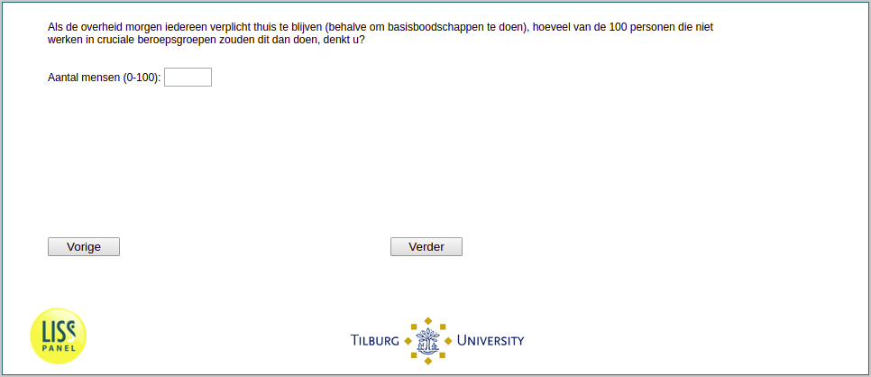

.. _w1e-q9:

 
 .. role:: raw-html(raw) 
        :format: html 

`q9` – Expected Compliance of Others
================================

If the government mandates tomorrow that everybody who does not work in a critical occupation needs to stay home except for basic shopping needs, how many individuals out of 100 would do so in your opinion? 

:raw-html:`&larr;` :ref:`w1e-q8` | :ref:`w1e-q10` :raw-html:`&rarr;`
