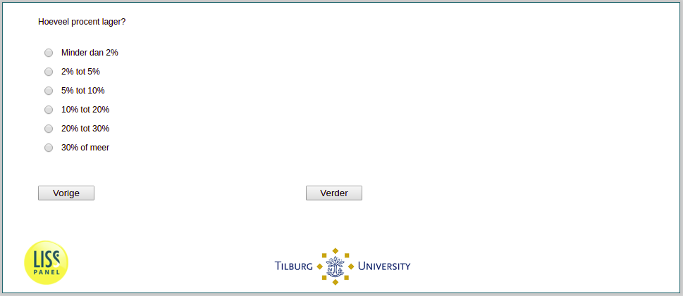

.. _w1e-v4: 

 
 .. role:: raw-html(raw) 
        :format: html 
 
`v4` – House Prices
======================== 

:raw-html:`&larr;` :ref:`w1e-v3` | :ref:`w1e-v5` :raw-html:`&rarr;` 
 
*Routing to the question depends on answer in:* :ref:`w1e-v3` 

How many percent ?
 
.. csv-table:: 
   :delim: | 
   :header: less than 2%, 2% to 5%, 5% to 10%, 10% to 20%, 30% or more
 
           :raw-html:`&#10063;`|:raw-html:`&#10063;`|:raw-html:`&#10063;`|:raw-html:`&#10063;`|:raw-html:`&#10063;` 

:raw-html:`&larr;` :ref:`w1e-v3` | :ref:`w1e-v5` :raw-html:`&rarr;` 
 
