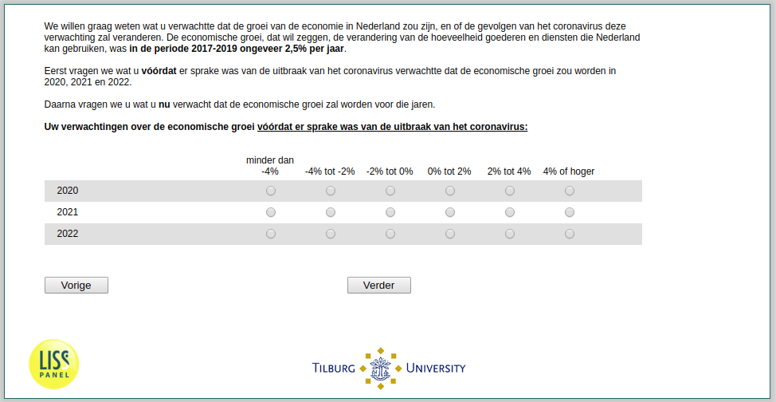

.. _ExpEcGrowth_before:

 
 .. role:: raw-html(raw) 
        :format: html 

`ExpEcGrowth_before` – Expected Economic Growth Before
==================================================

We willen graag weten wat u verwachtte dat de groei van de economie in Nederland zou zijn, en of de gevolgen van het coronavirus deze verwachting zal veranderen. De economische groei, dat wil zeggen, de verandering van de hoeveelheid goederen en diensten die Nederland kan gebruiken, was in de periode 2017-2019 ongeveer 2,5% per jaar.

Eerst vragen we wat u vóórdat er sprake was van de uitbraak van het coronavirus verwachtte dat de economische groei zou worden in 2020, 2021 en 2022.

Daarna vragen we u wat u nu verwacht dat de economische groei zal worden voor die jaren.

Uw verwachtingen over de economische groei vóórdat er sprake was van de uitbraak van het coronavirus:

.. csv-table::
   :delim: |
   :header: ,minder dan -4%, -4% tot -2%, -2% tot 0%, 0% tot 2%,  2% tot 4%,  4% of hoger

           2020 | :raw-html:`&#10063;`|:raw-html:`&#10063;`|:raw-html:`&#10063;`|:raw-html:`&#10063;`|:raw-html:`&#10063;`|:raw-html:`&#10063;`
           2021 | :raw-html:`&#10063;`|:raw-html:`&#10063;`|:raw-html:`&#10063;`|:raw-html:`&#10063;`|:raw-html:`&#10063;`|:raw-html:`&#10063;`
           2022 | :raw-html:`&#10063;`|:raw-html:`&#10063;`|:raw-html:`&#10063;`|:raw-html:`&#10063;`|:raw-html:`&#10063;`|:raw-html:`&#10063;`

:raw-html:`&larr;` :ref:`ExpUnempl_today` | :ref:`ExpEcGrowth_today` :raw-html:`&rarr;`
