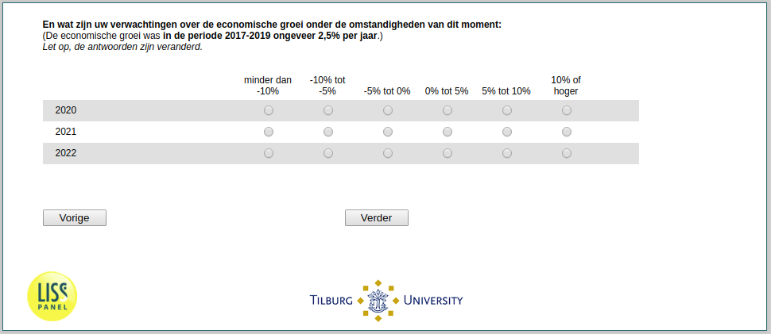

.. _ExpEcGrowth_today:

 
 .. role:: raw-html(raw) 
        :format: html 

ExpEcGrowth_today Expected Economic Growth Today
================================================

En wat zijn uw verwachtingen over de economische groei onder de
omstandigheden van dit moment: (De economische groei was in de periode 2017-2019 ongeveer 2,5% per jaar.)
Let op, de antwoorden zijn veranderd.

.. csv-table::
   :delim: |
   :header: ,minder dan -10%, -10% tot -5%,  -5% tot 0%, 0% tot 5%, 5% tot 10%,  10% of hoger

           2022 ```` | :raw-html:`&#10063;`|:raw-html:`&#10063;`|:raw-html:`&#10063;`|:raw-html:`&#10063;`|:raw-html:`&#10063;`|:raw-html:`&#10063;`
           2021 ```` | :raw-html:`&#10063;`|:raw-html:`&#10063;`|:raw-html:`&#10063;`|:raw-html:`&#10063;`|:raw-html:`&#10063;`|:raw-html:`&#10063;`
           2020 ```` | :raw-html:`&#10063;`|:raw-html:`&#10063;`|:raw-html:`&#10063;`|:raw-html:`&#10063;`|:raw-html:`&#10063;`|:raw-html:`&#10063;`




:raw-html:`&larr;` :ref:`ExpEcGrowth_before` | :ref:`ExpInfl_before` :raw-html:`&rarr;`
