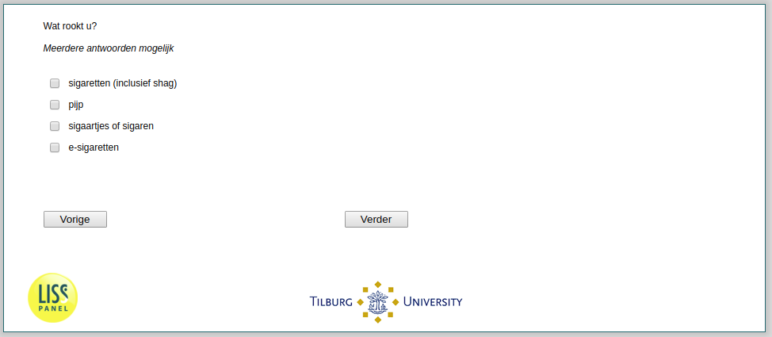

.. _he035:

 
 .. role:: raw-html(raw) 
        :format: html 

`he035` Smoking Type
==================
*Routing to the question depends on answer in:* :ref:`rook`

Wat rook u? Meerdere antwoorden mogelijk.

:raw-html:`&#10063;` – sigaretten (inclusief shag)

:raw-html:`&#10063;` – pijp

:raw-html:`&#10063;` – sigaartjes of sigaren

:raw-html:`&#10063;` – E-sigaretten

:raw-html:`&larr;` :ref:`rook` | :ref:`he036a` :raw-html:`&rarr;`
