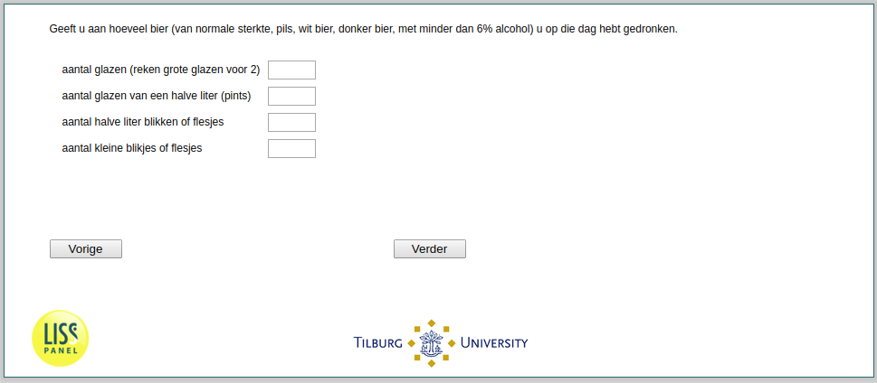

.. _he040a:

 
 .. role:: raw-html(raw) 
        :format: html 

he040a Beer Consumption
=======================
*Routing to the question depends on answer in:* :ref:`he040`

Geeft u aan hoeveel bier (van normale sterkte, pils, wit bier, donker bier, met minder dan
6% alcohol) u op die dag hebt gedronken.

.. csv-table::
   :delim: |

           Aantal halve liter blikken of flesjes ```` |  
           Aantal kleine blikjes of flesjes ```` |  
           Aantal glazen (reken grote glazen voor 2) ```` |  
           Aantal glazen van een halve liter (pints) ```` |  




:raw-html:`&larr;` :ref:`he40and` | :ref:`he040b` :raw-html:`&rarr;`
