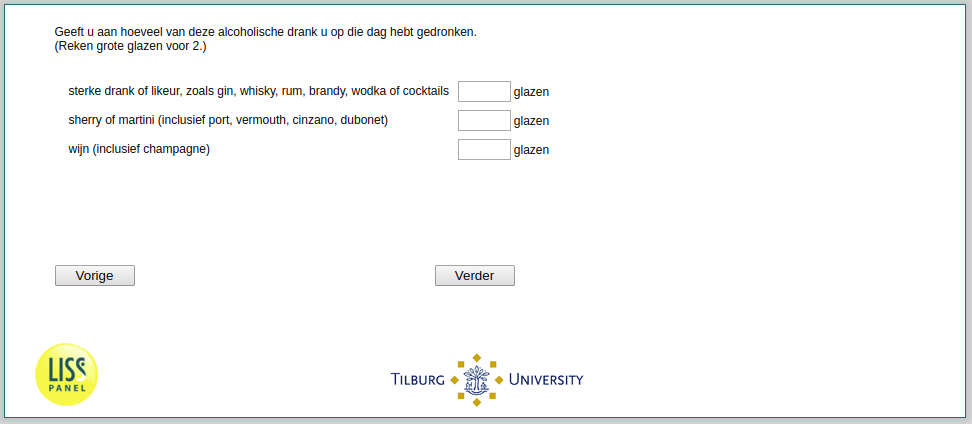

.. _he040c:

 
 .. role:: raw-html(raw) 
        :format: html 

he040c Strong Alcohol Consumption
=================================
*Routing to the question depends on answer in:* :ref:`he040`

Geeft u aan hoeveel van deze alcoholische drank u op die dag hebt gedronken. (Reken grote glazen voor 2.)

.. csv-table::
   :delim: |

           wijn (inclusief champagne) ```` |  
           sterke drank of likeur, zoals gin, whisky, rum, brandy, wodka of cocktails ```` |  
           sherry of martini (inclusief port, vermouth, cinzano, dubonet) ```` |  




:raw-html:`&larr;` :ref:`he040b` | :ref:`he040d` :raw-html:`&rarr;`
