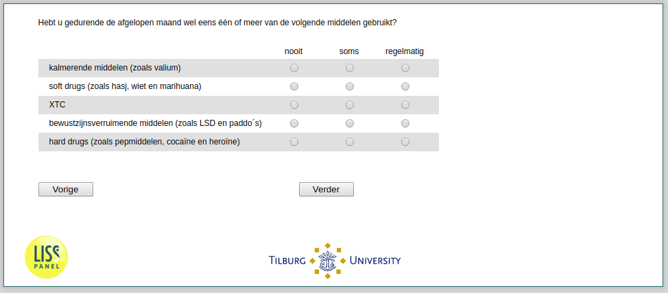

.. _he041:

 
 .. role:: raw-html(raw) 
        :format: html 

he041 Drug Intake
=================

Hebt u gedurende de afgelopen maand wel eens één of meer van de volgende middelen
Gebruikt?

.. csv-table::
   :delim: |
   :header: ,nooit, soms, regelmatig

           kalmerende middelen (zoals valium) ```` | :raw-html:`&#10063;`|:raw-html:`&#10063;`|:raw-html:`&#10063;`
           soft drugs (zoals hasj, wiet en marihuana) ```` | :raw-html:`&#10063;`|:raw-html:`&#10063;`|:raw-html:`&#10063;`
           XTC ```` | :raw-html:`&#10063;`|:raw-html:`&#10063;`|:raw-html:`&#10063;`
           bewustzijnsverruimende middelen (zoals LSD en paddo ́s) ```` | :raw-html:`&#10063;`|:raw-html:`&#10063;`|:raw-html:`&#10063;`
           hard drugs (zoals pepmiddelen, cocaïne en heroïne) ```` | :raw-html:`&#10063;`|:raw-html:`&#10063;`|:raw-html:`&#10063;`




:raw-html:`&larr;` :ref:`he040f` | :ref:`he042` :raw-html:`&rarr;`
