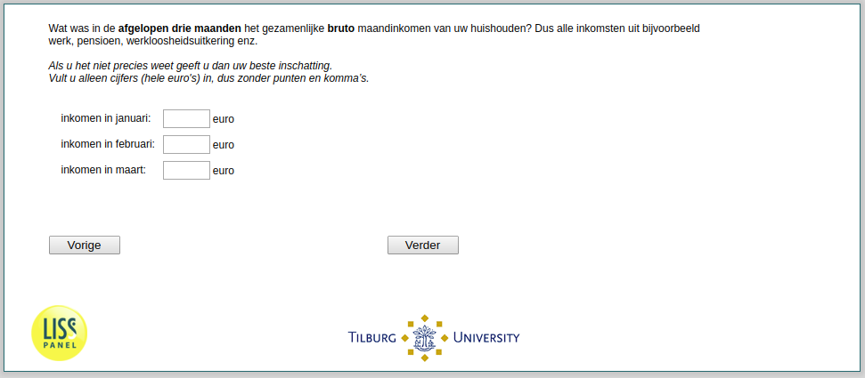

.. _income:

 
 .. role:: raw-html(raw) 
        :format: html 

income Income Last Three Months
===============================

Wat was in de afgelopen drie maanden het gezamenljke bruto maandinkomen van uw huishouden? Dus alle inkomsten uit bijvoorbeeld werk, pensioen, werkloosheidsuitkering enz. Als u het niet precies weet geeft u dan uw beste inschatting. Vult u alleen cijfers (hele euro's) in, dus zonder punten en komma’s.

.. csv-table::
   :delim: |

           inkomen in januari: ```` |  
           inkomen in februari: ```` |  
           inkomen in maart: ```` |  




:raw-html:`&larr;` :ref:`cruciaal_notempl` | :ref:`expectedincome` :raw-html:`&rarr;`
