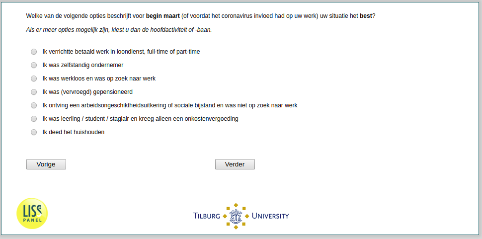

.. _q13:

 
 .. role:: raw-html(raw) 
        :format: html 

q13 Work Status Beginning of March
==================================

Welke van de volgende opties beschrijft voor begin maart (of voordat het coronavirus invloed had op uw werk) uw situatie het best? Als er meer opties mogelijk zijn, kiest u dan de hoofdactiviteit of -baan. ````

.. csv-table::
   :delim: |
   :header: k verrichtte betaald werk in loondienst ( full-time of part-time), Ik was zelfstandig ondernemer, Ik was werkloos en was op zoek naar werk, Ik was (vervroegd) gepensioneerd, Ik ontving een arbeidsongeschiktheidsuitkering of sociale bijstand en was niet op zoek naar werk, Ik was leerling / student / stagiair en kreeg alleen een onkostenvergoeding, Ik deed het huishouden

           :raw-html:`&#10063;`|:raw-html:`&#10063;`|:raw-html:`&#10063;`|:raw-html:`&#10063;`|:raw-html:`&#10063;`|:raw-html:`&#10063;`|:raw-html:`&#10063;`




:raw-html:`&larr;` :ref:`q23and` | :ref:`Q14header_1` :raw-html:`&rarr;`
