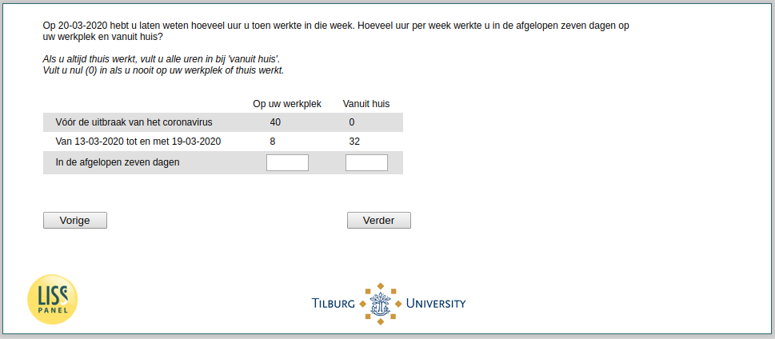

.. _q14header:

 
 .. role:: raw-html(raw) 
        :format: html 

q14header Working Hours Extended
================================
*Routing to the question depends on answer in:* :ref:`q13`

Op DatumB hebt u laten weten hoeveel uur u toen werkte in die week. Hoeveel uur per week werkte u in de afgelopen zeven dagen op uw werkplek en vanuit huis? Als u altijd thuis werkt, vult u alle uren in bij 'vanuit huis'. Vult u nul (0) in als u nooit op uw werkplek of thuis werkt.

.. csv-table::
   :delim: |

           Thuis van ^DatumB_min7 tot en met ^DatumB_min1 ```` |  
           Thuis in de afgelopen zeven dagen ```` |  
           Thuis vóór de uitbraak van het coronavirus ```` |  
           Werk vóór de uitbraak van het coronavirus ```` |  
           Werk van ^DatumB_min7 tot en met ^DatumB_min1 ```` |  
           Werk in de afgelopen zeven dagen ```` |  




:raw-html:`&larr;` :ref:`Q14header_1` | :ref:`q15` :raw-html:`&rarr;`
