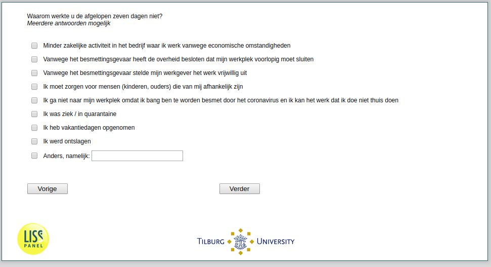

.. _q15:

 
 .. role:: raw-html(raw) 
        :format: html 

q15 Reasons for Not Working Among Employees
===========================================
*Routing to the question depends on answer in:* :ref:`q14_header`

Waarom werkte u de afgelopen zeven dagen niet? Meerdere antwoorden mogelijk

:raw-html:`&#10063;` Yes :raw-html:`&#10063;` No – Minder zakelijke activiteit in het bedrijf waar ik werk vanwege economische
Omstandigheden ````

:raw-html:`&#10063;` Yes :raw-html:`&#10063;` No – Vanwege het besmettingsgevaar heeft de overheid besloten dat mijn werkplek voorlopig
moet sluiten ````

:raw-html:`&#10063;` Yes :raw-html:`&#10063;` No – Vanwege het besmettingsgevaar stelde mijn werkgever het werk vrijwillig uit ````

:raw-html:`&#10063;` Yes :raw-html:`&#10063;` No – Ik moet zorgen voor mensen (kinderen, ouders) die van mij afhankelijk zijn ````

:raw-html:`&#10063;` Yes :raw-html:`&#10063;` No – Ik ga niet naar mijn werkplek omdat ik bang ben te worden besmet door het coronavirus
en ik kan het werk dat ik doe niet thuis doen ````

:raw-html:`&#10063;` Yes :raw-html:`&#10063;` No – Ik was ziek / in quarantaine ````

:raw-html:`&#10063;` Yes :raw-html:`&#10063;` No – Ik heb vakantiedagen opgenomen ````

:raw-html:`&#10063;` Yes :raw-html:`&#10063;` No – Ik werd ontslagen ````

:raw-html:`&#10063;` Yes :raw-html:`&#10063;` No – Anders, namelijk: ````





:raw-html:`&larr;` :ref:`q14header` | :ref:`q16` :raw-html:`&rarr;`
