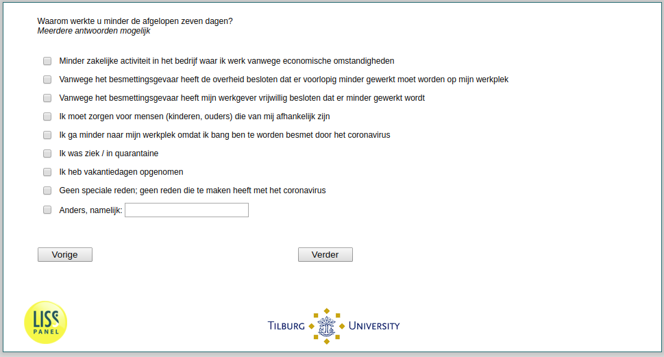

.. _q16:

 
 .. role:: raw-html(raw) 
        :format: html 

`q16` – Reasons for Working Less Among Employees
============================================
*Routing to the question depends on answer in:* :ref:`q14header`

Waarom werkte u minder de afgelopen zeven dagen? Meerdere antwoorden mogelijk

:raw-html:`&#10063;` – Minder zakelijke activiteit in het bedrijf waar ik werk vanwege economische
Omstandigheden

:raw-html:`&#10063;` – Vanwege het besmettingsgevaar heeft de overheid besloten dat er voorlopig minder gewerkt moet worden op mijn werkplek

:raw-html:`&#10063;` – Vanwege het besmettingsgevaar heeft mijn werkgever vrijwillig besloten dat er minder gewerkt wordt

:raw-html:`&#10063;` – Ik moet zorgen voor mensen (kinderen, ouders) die van mij afhankelijk zijn

:raw-html:`&#10063;` – Ik ga minder naar mijn werkplek omdat ik bang ben te worden besmet door het coronavirus

:raw-html:`&#10063;` – Ik was ziek / in quarantaine

:raw-html:`&#10063;` – Ik heb vakantiedagen opgenomen

:raw-html:`&#10063;` – Geen speciale reden, geen reden die te maken heeft met het coronavirus

:raw-html:`&#10063;` – Anders, namelijk:

:raw-html:`&larr;` :ref:`q15` | :ref:`q17` :raw-html:`&rarr;`
