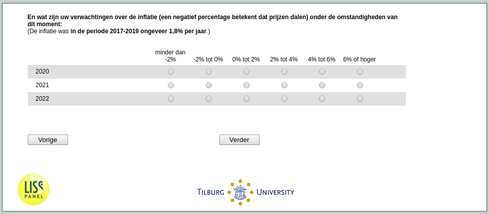

.. _w2d-ExpInfl_today: 

 
 .. role:: raw-html(raw) 
        :format: html 
 
`ExpInfl_today` – Expected Inflation Today
========================================================== 

:raw-html:`&larr;` :ref:`w2d-ExpInfl_before` | :ref:`w2d-StockTrading` :raw-html:`&rarr;` 
 

En wat zijn uw verwachtingen over de inflatie (een negatief percentage betekent
dat prijzen dalen) onder de omstandigheden van dit moment:
(De inflatie was in de periode 2017-2019 ongeveer 1,8% per jaar.)
 
.. csv-table:: 
   :delim: | 
   :header: ,minder dan -2%, -2% tot 0%, 0% tot 2%,  2% tot 4%, 4% tot 6%,  6% of hoger
 
           2020 | :raw-html:`&#10063;`|:raw-html:`&#10063;`|:raw-html:`&#10063;`|:raw-html:`&#10063;`|:raw-html:`&#10063;`|:raw-html:`&#10063;` 
           2021 | :raw-html:`&#10063;`|:raw-html:`&#10063;`|:raw-html:`&#10063;`|:raw-html:`&#10063;`|:raw-html:`&#10063;`|:raw-html:`&#10063;` 
           2022 | :raw-html:`&#10063;`|:raw-html:`&#10063;`|:raw-html:`&#10063;`|:raw-html:`&#10063;`|:raw-html:`&#10063;`|:raw-html:`&#10063;` 

:raw-html:`&larr;` :ref:`w2d-ExpInfl_before` | :ref:`w2d-StockTrading` :raw-html:`&rarr;` 
 
