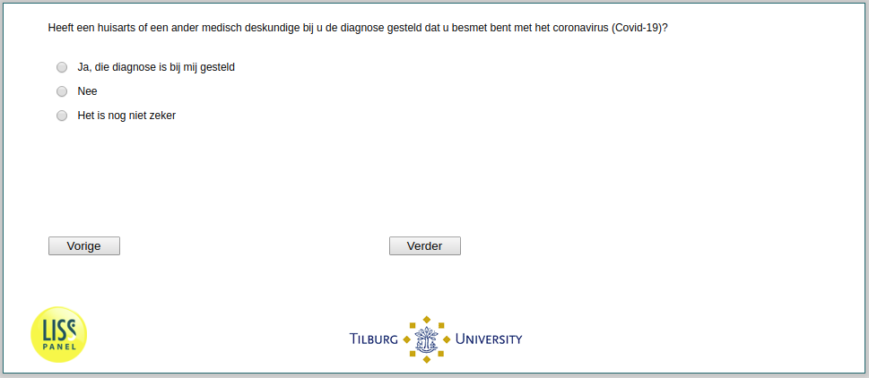

.. _w2d-InfectionDiagnosed:

 
 .. role:: raw-html(raw) 
        :format: html 

`InfectionDiagnosed` – Infection Diagnosed
==========================================

:raw-html:`&larr;` :ref:`w2d-intro` | :ref:`w2d-SelfPerceivedInfection` :raw-html:`&rarr;` 

Heeft een huisarts of een ander medisch deskundige bij u de diagnose gesteld dat u besmet bent met het coronavirus (Covid-19)?

.. csv-table::
   :delim: |
   :header: Ja die diagnose is bij mij gesteld, Nee, Het is nog niet zeker

           :raw-html:`&#10063;`|:raw-html:`&#10063;`|:raw-html:`&#10063;`

:raw-html:`&larr;` :ref:`w2d-intro` | :ref:`w2d-SelfPerceivedInfection` :raw-html:`&rarr;` 

