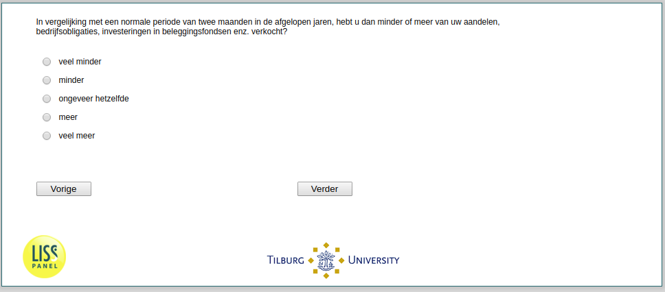

.. _w2d-Stock4:

 
 .. role:: raw-html(raw) 
        :format: html 

`Stock4` – Amount Sold Among Sellers
================================
*Routing to the question depends on answer in:* :ref:`StockTrading`

In vergelijking met een normale periode van twee maanden in de afgelopen jaren, hebt u dan minder of meer van uw aandelen, bedrijfsobligaties, investeringen in beleggingsfondsen enz. verkocht?

.. csv-table::
   :delim: |
   :header: veel minder, minder, ongeveer hetzelfde, meer, veel meer

           :raw-html:`&#10063;`|:raw-html:`&#10063;`|:raw-html:`&#10063;`|:raw-html:`&#10063;`|:raw-html:`&#10063;`

:raw-html:`&larr;` :ref:`w2d-Stock3` | :ref:`w2d-Stock5` :raw-html:`&rarr;`
