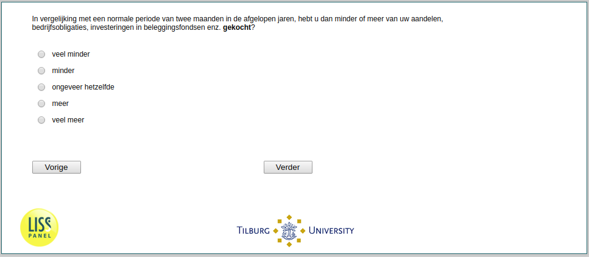

.. _w2d-Stock5: 

 
 .. role:: raw-html(raw) 
        :format: html 
 
`Stock5` – Amount Bought Among Those Who Bought And Sold
================================================================= 

:raw-html:`&larr;` :ref:`w2d-Stock4` | :ref:`w2d-Stock6` :raw-html:`&rarr;` 
 
*Routing to the question depends on answer in:* :ref:`w2d-StockTrading` 

In vergelijking met een normale periode van twee maanden in de afgelopen jaren, hebt u dan minder of meer van uw aandelen, bedrijfsobligaties, investeringen in beleggingsfondsen enz. gekocht?
 
.. csv-table:: 
   :delim: | 
   :header: veel minder, minder, ongeveer hetzelfde, meer, veel meer
 
           :raw-html:`&#10063;`|:raw-html:`&#10063;`|:raw-html:`&#10063;`|:raw-html:`&#10063;`|:raw-html:`&#10063;` 

:raw-html:`&larr;` :ref:`w2d-Stock4` | :ref:`w2d-Stock6` :raw-html:`&rarr;` 
 
