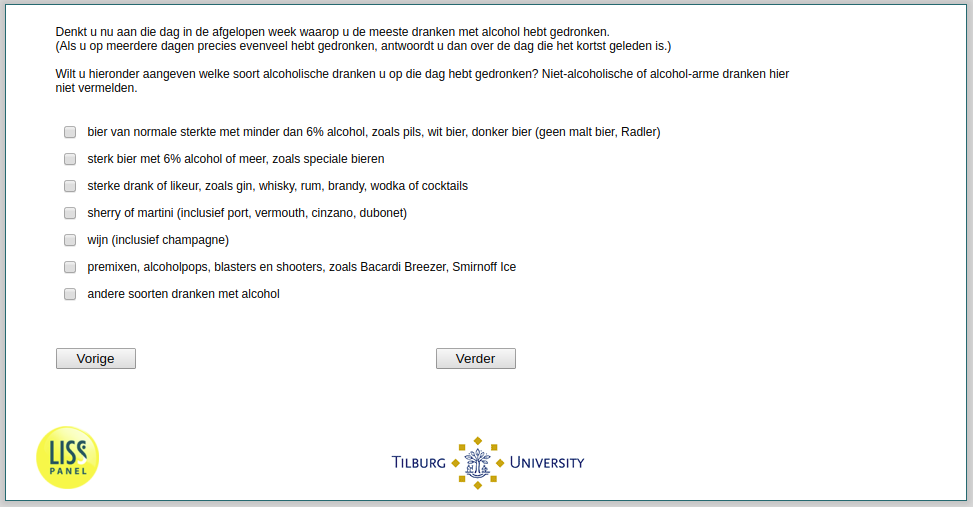

.. _w2d-he040:

 
 .. role:: raw-html(raw) 
        :format: html 

`he040` – Alcohol Type
======================

:raw-html:`&larr;` :ref:`w2d-he039` | :ref:`w2d-he040and` :raw-html:`&rarr;` 

*Routing to the question depends on answer in:* :ref:`w2d-he038`

Denkt u nu aan die dag in de afgelopen week waarop u de meeste dranken met alcohol hebt gedronken. (Als u op meerdere dagen precies evenveel hebt gedronken, antwoordt u dan over de dag die het kortst geleden is.) Wilt u hieronder aangeven welke soort alcoholische dranken u op die dag hebt gedronken? Niet-alcoholische of alcohol-arme dranken hier niet vermelden.

:raw-html:`&#10063;` – bier van normale sterkte met minder dan 6% alcohol, zoals pils, wit bier, donker bier
(geen malt bier, Radler)

:raw-html:`&#10063;` – sterk bier met 6% alcohol of meer, zoals speciale bieren

:raw-html:`&#10063;` – sterke drank of likeur, zoals gin, whisky, rum, brandy, wodka of cocktails

:raw-html:`&#10063;` – sherry of martini (inclusief port, vermouth, cinzano, dubonet)

:raw-html:`&#10063;` – wijn (inclusief champagne)

:raw-html:`&#10063;` – premixen, alcoholpops, blasters en shooters, zoals Bacardi Breezer, Smirnoff Ice

:raw-html:`&#10063;` – andere soorten dranken met alcohol

:raw-html:`&larr;` :ref:`w2d-he039` | :ref:`w2d-he040and` :raw-html:`&rarr;` 

