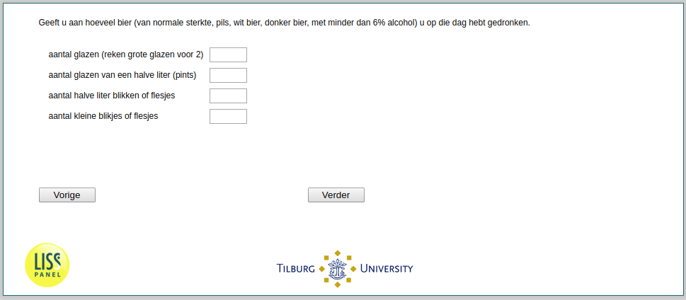

.. _w2d-he040a: 

 
 .. role:: raw-html(raw) 
        :format: html 
 
`he040a` – Beer Consumption
==================================== 

:raw-html:`&larr;` :ref:`w2d-he040and` | :ref:`w2d-he040b` :raw-html:`&rarr;` 
 
*Routing to the question depends on answer in:* :ref:`w2d-he040` 

Geeft u aan hoeveel bier (van normale sterkte, pils, wit bier, donker bier, met minder dan
6% alcohol) u op die dag hebt gedronken.
 
.. csv-table:: 
   :delim: | 
 
           Aantal kleine blikjes of flesjes | :raw-html:`<form><input type="text" id="fname" name="fname"> </form>` 
           Aantal halve liter blikken of flesjes | :raw-html:`<form><input type="text" id="fname" name="fname"> </form>` 
           Aantal glazen van een halve liter (pints) | :raw-html:`<form><input type="text" id="fname" name="fname"> </form>` 
           Aantal glazen (reken grote glazen voor 2) | :raw-html:`<form><input type="text" id="fname" name="fname"> </form>` 

:raw-html:`&larr;` :ref:`w2d-he040and` | :ref:`w2d-he040b` :raw-html:`&rarr;` 
 
