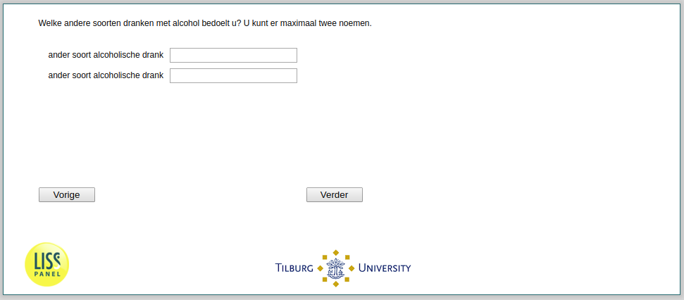

.. _w2d-he040and: 

 
 .. role:: raw-html(raw) 
        :format: html 
 
`he040and` – Alcohol Type
==================================== 

:raw-html:`&larr;` :ref:`w2d-he040` | :ref:`w2d-he040a` :raw-html:`&rarr;` 
 
*Routing to the question depends on answer in:* :ref:`w2d-he040` 

Welke andere soorten dranken met alcohol bedoelt u? U kunt er maximaal twee noemen.
 
.. csv-table:: 
   :delim: | 
 
           ander soort alcoholische drank | :raw-html:`<form><input type="text" id="fname" name="fname"> </form>` 
           ander soort alcoholische drank | :raw-html:`<form><input type="text" id="fname" name="fname"> </form>` 

:raw-html:`&larr;` :ref:`w2d-he040` | :ref:`w2d-he040a` :raw-html:`&rarr;` 
 
