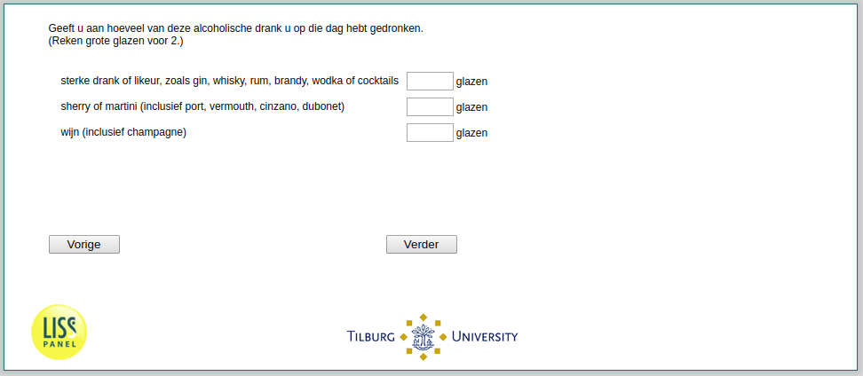

.. _w2d-he040c: 

 
 .. role:: raw-html(raw) 
        :format: html 
 
`he040c` – Strong Alcohol Consumption
============================================== 

:raw-html:`&larr;` :ref:`w2d-he040b` | :ref:`w2d-he040d` :raw-html:`&rarr;` 
 
*Routing to the question depends on answer in:* :ref:`w2d-he040` 

Geeft u aan hoeveel van deze alcoholische drank u op die dag hebt gedronken. (Reken grote glazen voor 2.)
 
.. csv-table:: 
   :delim: | 
 
           sterke drank of likeur, zoals gin, whisky, rum, brandy, wodka of cocktails | :raw-html:`<form><input type="text" id="fname" name="fname"> </form>` 
           sherry of martini (inclusief port, vermouth, cinzano, dubonet) | :raw-html:`<form><input type="text" id="fname" name="fname"> </form>` 
           wijn (inclusief champagne) | :raw-html:`<form><input type="text" id="fname" name="fname"> </form>` 

:raw-html:`&larr;` :ref:`w2d-he040b` | :ref:`w2d-he040d` :raw-html:`&rarr;` 
 
