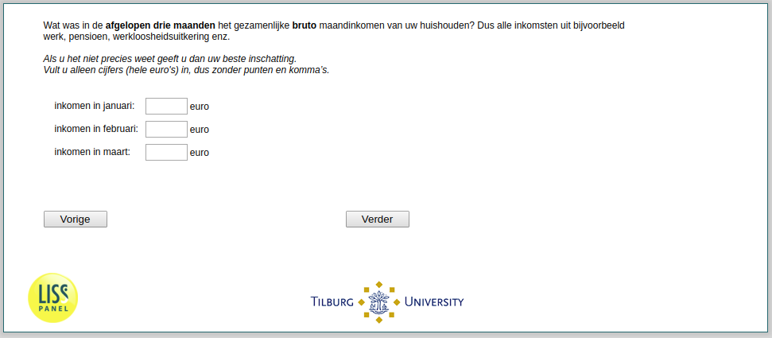

.. _w2d-income: 

 
 .. role:: raw-html(raw) 
        :format: html 
 
`income` – Income Last Three Months
============================================ 

:raw-html:`&larr;` :ref:`w2d-cruciaal_notempl` | :ref:`w2d-expectedincome` :raw-html:`&rarr;` 
 

Wat was in de afgelopen drie maanden het gezamenljke bruto maandinkomen van uw huishouden? Dus alle inkomsten uit bijvoorbeeld werk, pensioen, werkloosheidsuitkering enz. Als u het niet precies weet geeft u dan uw beste inschatting. Vult u alleen cijfers (hele euro's) in, dus zonder punten en komma’s.
 
.. csv-table:: 
   :delim: | 
 
           inkomen in januari: | :raw-html:`<form><input type="text" id="fname" name="fname"> </form>` 
           inkomen in februari: | :raw-html:`<form><input type="text" id="fname" name="fname"> </form>` 
           inkomen in maart: | :raw-html:`<form><input type="text" id="fname" name="fname"> </form>` 

:raw-html:`&larr;` :ref:`w2d-cruciaal_notempl` | :ref:`w2d-expectedincome` :raw-html:`&rarr;` 
 
