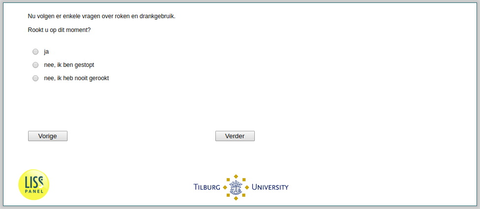

.. _w2d-rook: 

 
 .. role:: raw-html(raw) 
        :format: html 
 
`rook` – Smoking
======================= 

:raw-html:`←` :ref:`w2d-q7` | :ref:`w2d-he035` :raw-html:`→` 
 

Nu volgen er enkele vragen over roken en drankgebruik. Rookt u op dit moment?
 
.. csv-table:: 
   :delim: | 
   :header: ja, nee ik ben gestopt, nee ik heb nooit gerookt
 
           :raw-html:`❏`|:raw-html:`❏`|:raw-html:`❏` 

:raw-html:`←` :ref:`w2d-q7` | :ref:`w2d-he035` :raw-html:`→` 
 
