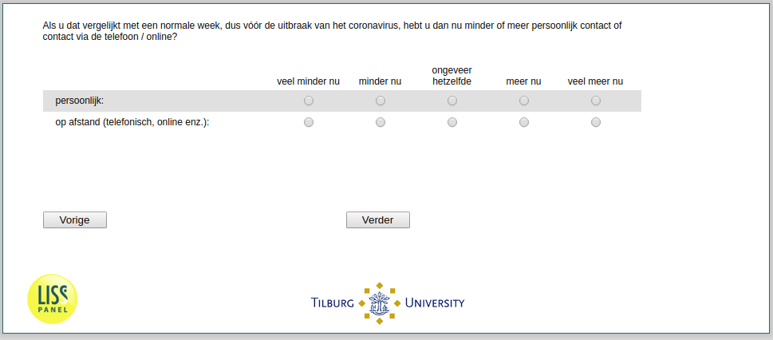

.. _w2d-soccompt: 

 
 .. role:: raw-html(raw) 
        :format: html 
 
`soccompt` – Change Contacts
======================================= 

:raw-html:`&larr;` :ref:`w2d-soccont` | :ref:`w2d-q22` :raw-html:`&rarr;` 
 

Als u dat vergelijkt met een normale week, dus vóór de uitbraak van het coronavirus, hebt u dan nu minder of meer persoonlijk contact of contact via de telefoon / online?
 
.. csv-table:: 
   :delim: | 
   :header: ,veel minder nu, minder nu, ongeveer hetzelfde, meer nu, veel meer nu
 
           persoonlijk: | :raw-html:`&#10063;`|:raw-html:`&#10063;`|:raw-html:`&#10063;`|:raw-html:`&#10063;`|:raw-html:`&#10063;` 
           op afstand (telefonisch, online enz.): | :raw-html:`&#10063;`|:raw-html:`&#10063;`|:raw-html:`&#10063;`|:raw-html:`&#10063;`|:raw-html:`&#10063;` 

:raw-html:`&larr;` :ref:`w2d-soccont` | :ref:`w2d-q22` :raw-html:`&rarr;` 
 
