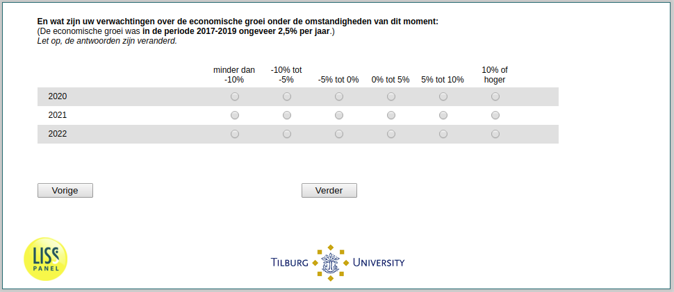

.. _ExpEcGrowth_today:

 
 .. role:: raw-html(raw) 
        :format: html 

`ExpEcGrowth_today` – Expected Economic Growth Today
================================================

Second, we would like to know the growth rates of the Dutch economy that you expect for the years 2020, 2021, and 2022 as of today. Careful: The categories have changed!

.. csv-table::
   :delim: |
   :header: ,less than -10%, -10% to -5%, -5% to 0%, 0% to 5%, 5% to 10%, 10% or higher

           2021 | :raw-html:`&#10063;`|:raw-html:`&#10063;`|:raw-html:`&#10063;`|:raw-html:`&#10063;`|:raw-html:`&#10063;`|:raw-html:`&#10063;`
           2022 | :raw-html:`&#10063;`|:raw-html:`&#10063;`|:raw-html:`&#10063;`|:raw-html:`&#10063;`|:raw-html:`&#10063;`|:raw-html:`&#10063;`
           2020 | :raw-html:`&#10063;`|:raw-html:`&#10063;`|:raw-html:`&#10063;`|:raw-html:`&#10063;`|:raw-html:`&#10063;`|:raw-html:`&#10063;`

:raw-html:`&larr;` :ref:`ExpEcGrowth_before` | :ref:`ExpInfl_before` :raw-html:`&rarr;`
