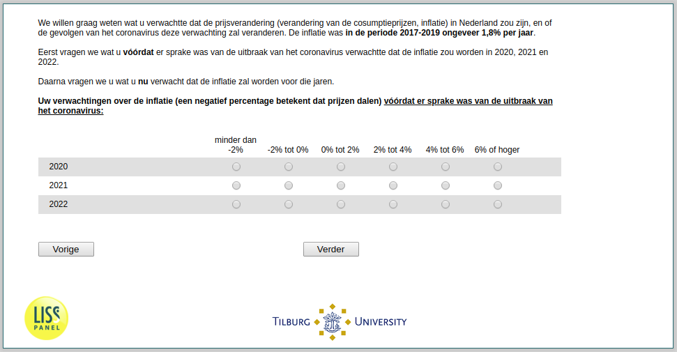

.. _ExpInfl_before:

 
 .. role:: raw-html(raw) 
        :format: html 

`ExpInfl_before` – Expected Inflation Before
========================================

We are interested in your expectations of the inflation rate in the Netherlands (as measured by changes of the Consumer Price Index), and how the impact of the corona virus has affected your expectations. On average, consumer prices have grown by around 1.8% in the years 2017-2019. 

First, we would like to know the inflation rate that you expected for the years 2020, 2021, and 2022 before there was a sign of the coronavirus crisis. 

.. csv-table::
   :delim: |
   :header: ,less than -2%, -2% to 0%, 0% to 2%, 2% to 4%, 4% to 6%, 6% or higher

           2020 | :raw-html:`&#10063;`|:raw-html:`&#10063;`|:raw-html:`&#10063;`|:raw-html:`&#10063;`|:raw-html:`&#10063;`|:raw-html:`&#10063;`
           2021 | :raw-html:`&#10063;`|:raw-html:`&#10063;`|:raw-html:`&#10063;`|:raw-html:`&#10063;`|:raw-html:`&#10063;`|:raw-html:`&#10063;`
           2022 | :raw-html:`&#10063;`|:raw-html:`&#10063;`|:raw-html:`&#10063;`|:raw-html:`&#10063;`|:raw-html:`&#10063;`|:raw-html:`&#10063;`

:raw-html:`&larr;` :ref:`ExpEcGrowth_today` | :ref:`ExpInfl_today` :raw-html:`&rarr;`
