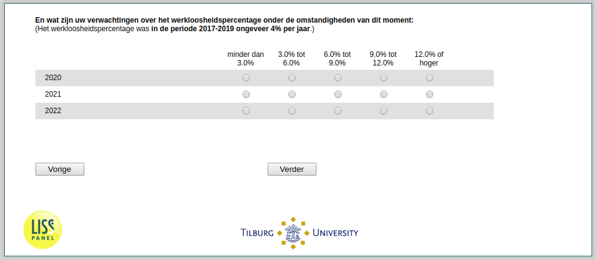

.. _ExpUnempl_today:

 
 .. role:: raw-html(raw) 
        :format: html 

`ExpUnempl_today` – Expected Unemployment Today
===========================================

Second, we would like to know the unemployment rates that you expect for the years 2020, 2021, and 2022 as of today. Expectation as of today / with the coronavirus pandemic:

.. csv-table::
   :delim: |
   :header: ,less than 3.0%, 3.0% to 6.0%, 6.0% to 9.0%, 9.0% to 12.0%, 12.0% or higher

           2020 | :raw-html:`&#10063;`|:raw-html:`&#10063;`|:raw-html:`&#10063;`|:raw-html:`&#10063;`|:raw-html:`&#10063;`
           2021 | :raw-html:`&#10063;`|:raw-html:`&#10063;`|:raw-html:`&#10063;`|:raw-html:`&#10063;`|:raw-html:`&#10063;`
           2022 | :raw-html:`&#10063;`|:raw-html:`&#10063;`|:raw-html:`&#10063;`|:raw-html:`&#10063;`|:raw-html:`&#10063;`

:raw-html:`&larr;` :ref:`ExpUnempl_before` | :ref:`ExpEcGrowth_before` :raw-html:`&rarr;`
