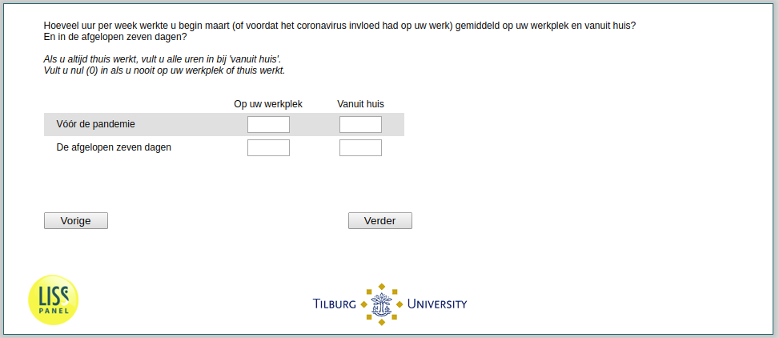

.. _Q14header_1:

 
 .. role:: raw-html(raw) 
        :format: html 

`Q14header_1` – Working Hours
=========================
*Routing to the question depends on answer in:* :ref:`q13`

On average, how many hours per week did you work at the workplace and from home in early March (or before the coronavirus affected your work)? And in the past seven days? If you always work from home, fill in all hours at 'from home'. Enter zero (0) if you never work at your workplace or at home.

.. csv-table::
   :delim: |

           Hours at workplace in the past seven days | :raw-html:`<form><input type="text" id="fname" name="fname"> </form>`
           Hours at from home in the past seven days | :raw-html:`<form><input type="text" id="fname" name="fname"> </form>`
           Hours at workplace before the pandemic | :raw-html:`<form><input type="text" id="fname" name="fname"> </form>`
           Hours at from home before the pandemic | :raw-html:`<form><input type="text" id="fname" name="fname"> </form>`

:raw-html:`&larr;` :ref:`q13` | :ref:`q14header` :raw-html:`&rarr;`
