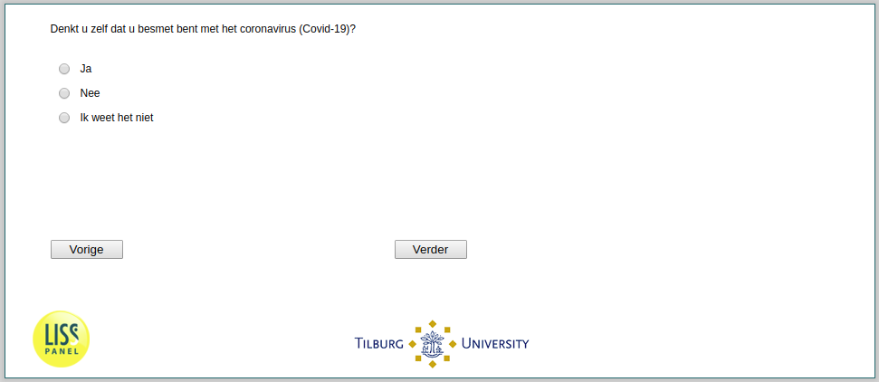

.. _SelfPerceivedInfection:

 
 .. role:: raw-html(raw) 
        :format: html 

`SelfPerceivedInfection` – SelfPerceivedInfection
=============================================

Do you think you’ve been infected with the coronavirus (COVID-19)?

.. csv-table::
   :delim: |
   :header: Yes, No, Unsure

           :raw-html:`&#10063;`|:raw-html:`&#10063;`|:raw-html:`&#10063;`

:raw-html:`&larr;` :ref:`InfectionDiagnosed` | :ref:`q1header` :raw-html:`&rarr;`
