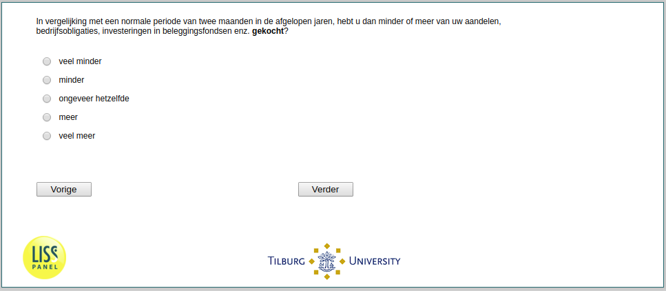

.. _Stock5:

 
 .. role:: raw-html(raw) 
        :format: html 

`Stock5` – Amount Bought Among Those who Bought And Sold
====================================================
*Routing to the question depends on answer in:* :ref:`StockTrading`

Compared to a typical two months-period of in recent years, how much did you spend on risky assets such as stocks / mutual funds / corporate bonds?

.. csv-table::
   :delim: |
   :header: Much less, less, about the same, more, much more

           :raw-html:`&#10063;`|:raw-html:`&#10063;`|:raw-html:`&#10063;`|:raw-html:`&#10063;`|:raw-html:`&#10063;`

:raw-html:`&larr;` :ref:`Stock4` | :ref:`Stock6` :raw-html:`&rarr;`
