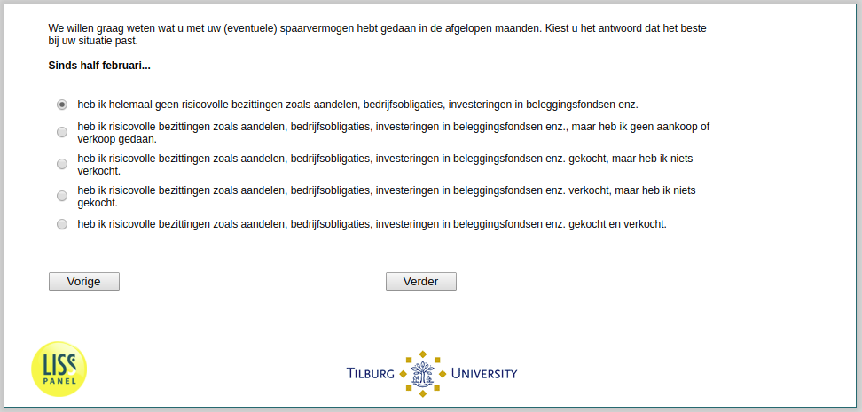

.. _StockTrading:

 
 .. role:: raw-html(raw) 
        :format: html 

`StockTrading` – Stock Trading
==========================

We are interested in how you invested your savings in recent months. Please pick the option that applies to your situation. In the period since mid-February .. 

:raw-html:`&#10063;` – I did not own risky assets such as stocks / mutual funds / corporate bonds at any point.

:raw-html:`&#10063;` – I have owned risky assets such as stocks / mutual funds / corporate bonds and I have not bought or sold anything.

:raw-html:`&#10063;` – I have bought risky assets such as stocks / mutual funds / corporate bonds, but I did not sell any.

:raw-html:`&#10063;` – I have sold risky assets such as stocks / mutual funds / corporate bonds, but I did not buy any.

:raw-html:`&#10063;` – I have both bought and sold risky assets such as stocks / mutual funds / corporate bonds.

:raw-html:`&larr;` :ref:`ExpInfl_today` | :ref:`Stock3` :raw-html:`&rarr;`
