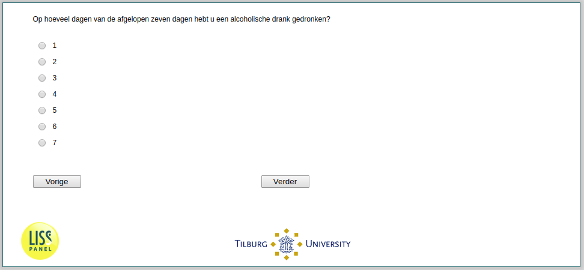

.. _he039:

 
 .. role:: raw-html(raw) 
        :format: html 

`he039` – Days Alcohol Consumption
==============================
*Routing to the question depends on answer in:* :ref:`he038`

On how many of the past seven days did you have a drink containing alcohol?

.. csv-table::
   :delim: |
   :header: 1,2,3,4,5,6,7

           :raw-html:`❏`|:raw-html:`❏`|:raw-html:`❏`|:raw-html:`❏`|:raw-html:`❏`|:raw-html:`❏`|:raw-html:`❏`

:raw-html:`←` :ref:`he038` | :ref:`he040` :raw-html:`→`
