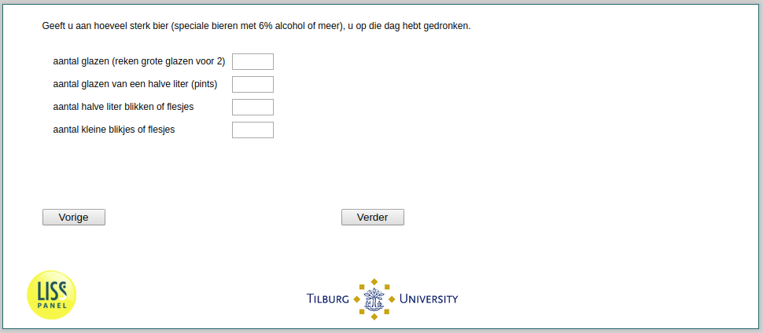

.. _he040b:

 
 .. role:: raw-html(raw) 
        :format: html 

`he040b` – Strong Beer Consumption
==============================
*Routing to the question depends on answer in:* :ref:`he040`

Can you indicate below how much strong beer (special beers with 6% alcohol or more),
you drank that day

.. csv-table::
   :delim: |

           number of glasses (count large glasses as 2) | :raw-html:`<form><input type="text" id="fname" name="fname"> </form>`
           6 number of half liter glasses (pints) | :raw-html:`<form><input type="text" id="fname" name="fname"> </form>`
           number of half liter cans or bottles | :raw-html:`<form><input type="text" id="fname" name="fname"> </form>`
           number of small cans or bottles | :raw-html:`<form><input type="text" id="fname" name="fname"> </form>`

:raw-html:`&larr;` :ref:`he040a` | :ref:`he040c` :raw-html:`&rarr;`
