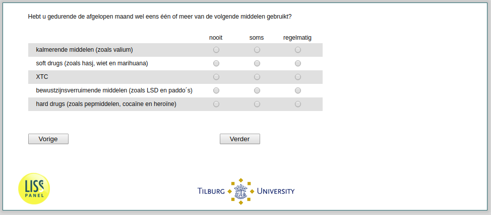

.. _he041:

 
 .. role:: raw-html(raw) 
        :format: html 

`he041` – Drug Intake
=================

Did you use one or more of the following substances over the past month?

.. csv-table::
   :delim: |
   :header: ,never, sometimes, regularly

           sedatives (such as valium) | :raw-html:`❏`|:raw-html:`❏`|:raw-html:`❏`
           soft drugs (such as hashish, marijuana) | :raw-html:`❏`|:raw-html:`❏`|:raw-html:`❏`
           XTC | :raw-html:`❏`|:raw-html:`❏`|:raw-html:`❏`
           hallucinogens (such as LSD, magic mushrooms) | :raw-html:`❏`|:raw-html:`❏`|:raw-html:`❏`
           hard drugs (such as stimulants, cocaine, heroin) | :raw-html:`❏`|:raw-html:`❏`|:raw-html:`❏`

:raw-html:`←` :ref:`he040f` | :ref:`he042` :raw-html:`→`
